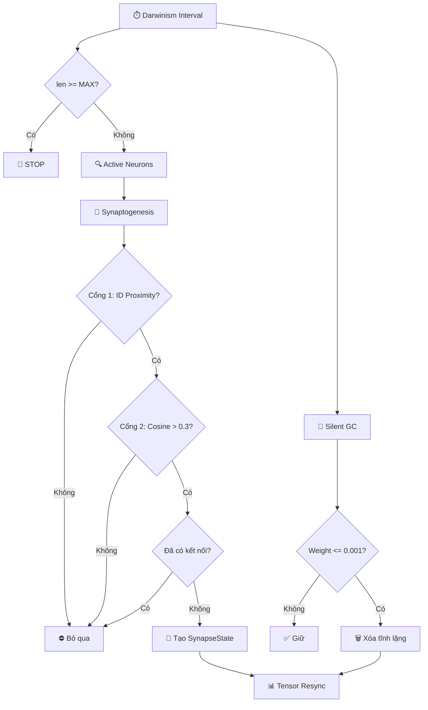

# Bản Đồ Phẫu Thuật: Monotonic Additive Plasticity (INC-006)

Kế hoạch tái cấu trúc hàm `process_neural_darwinism` và các thành phần liên quan để chuyển từ kiến trúc "Tiến hóa Phá hủy" sang kiến trúc "Sinh tủy Không Tiết rụng + Đào thải Tĩnh lặng".

---

## Tổng quan Kiến trúc Mới

4 nguyên lý cốt lõi:
1. **Zero-Erasure & Silent Deletion**: Không bao giờ xóa Synapse khi Weight > 0.001. Chỉ thu hồi "xác chết toán học" (Weight ≈ 0).
2. **Targeted Synaptogenesis & Cluster Radius**: Mọc rễ mới giữa các Nơ-ron Hebbian cục bộ.
3. **Dynamic Skull Limit**: `MAX_SYNAPSES = int(N * (N-1) * 0.3)`.
4. **Vectorized Operation**: Mọi thao tác trên `heavy_tensors['weights']` (Numpy), không duyệt List Python.

---

## Proposed Changes

### Khu Vực 1: Lõi Darwinism

#### [MODIFY] [snn_advanced_features_theus.py](file:///C:/Users/dohoang/projects/EmotionAgent/src/processes/snn_advanced_features_theus.py)

Đây là tâm chấn. Hàm `process_neural_darwinism` (dòng 301-505) sẽ bị **viết lại hoàn toàn**.

**XÓA hoàn toàn các khối logic sau:**

| Dòng | Mô tả | Lý do xóa |
|------|--------|------------|
| 345-370 | PART 1: Synapse Fitness Update (`synapse.fitness *= ...`) | Hệ thống Fitness/Selection bị bãi bỏ. STDP tự điều tiết Weight. |
| 372-389 | Selection: `np.percentile` → Lọc survivors | Cơ chế chém giết bạo lực gây Non-stationarity. |
| 391-475 | PART 2: Neuron Recycling (`new_proto = np.random.randn(...)`) | Reset ngẫu nhiên Prototype gây Representational Drift. |
| 477-483 | Memory Leak Fix: `sorted(synapses, key=weight)[:MAX]` | Cơ chế cắt theo Weight tuyệt đối thay thế bằng Dynamic Skull Limit. |

**THÊM các khối logic mới:**

1. **Dynamic Skull Limit** (Thay thế dòng 477-483):
```python
N = int(global_ctx.num_neurons)
MAX_SYNAPSES = int(N * (N - 1) * 0.3)
```

2. **Silent Garbage Collection** (Thay thế dòng 372-389):
```python
# NOTE: Chỉ xóa Synapse khi Weight đã bị STDP ăn mòn về mức vô hình.
# Tại ngưỡng này, xóa vật lý không tạo bất kỳ cú sốc nào cho MLP.
SILENT_DEATH_THRESHOLD = 0.001
before_count = len(domain.synapses)
domain.synapses = [s for s in domain.synapses if s.weight > SILENT_DEATH_THRESHOLD]
gc_count = before_count - len(domain.synapses)
```

3. **Targeted Synaptogenesis với Cluster Radius** (Thay thế dòng 391-475):
```python
# NOTE: Mọc cục bộ - Fire Together, Wire Together
# Cluster Radius giới hạn mọc rễ chỉ giữa neuron lân cận.
CLUSTER_RADIUS = max(10, N // 10)  # ~10% không gian ID
current_synapse_count = len(domain.synapses)
if current_synapse_count >= MAX_SYNAPSES:
    return  # Sọ não đầy

# Tìm Nơ-ron đang bắn gai gần đây (Active Neurons)
active_neurons = [n for n in domain.neurons 
                  if (domain.current_time - n.last_fire_time) < darwinism_interval]

# Tìm cặp Active chưa có kết nối -> Mọc rễ mới (Dual-Gate Eligibility)
new_synapses = []
existing_pairs = set((s.pre_neuron_id, s.post_neuron_id) for s in domain.synapses)

# NOTE: Pre-compute prototype matrix cho Cosine gate — chỉ tính 1 lần.
from src.core.snn_context_theus import ensure_heavy_tensors_initialized
ensure_heavy_tensors_initialized(snn_ctx)
prototypes = domain.heavy_tensors['prototypes']  # (N, D)

for n_a in active_neurons:
    for n_b in active_neurons:
        if n_a.neuron_id == n_b.neuron_id:
            continue
        # === CỔNG 1: Vật lý (ID Proximity) — O(1), lọc sơ bộ nhanh ===
        if abs(n_a.neuron_id - n_b.neuron_id) > CLUSTER_RADIUS:
            continue
        if (n_a.neuron_id, n_b.neuron_id) in existing_pairs:
            continue
        if current_synapse_count + len(new_synapses) >= MAX_SYNAPSES:
            break
        # === CỔNG 2: Ngữ nghĩa (Cosine Similarity) — chỉ tính trên ~10% cặp đã lọt Cổng 1 ===
        proto_a = prototypes[n_a.neuron_id]
        proto_b = prototypes[n_b.neuron_id]
        cosine_sim = np.dot(proto_a, proto_b) / (np.linalg.norm(proto_a) * np.linalg.norm(proto_b) + 1e-8)
        if cosine_sim < 0.3:  # Ngưỡng tương đồng ngữ nghĩa tối thiểu
            continue
        # === Cả hai Cổng đều mở → Cho phép mọc ===
        if np.random.random() < synaptogenesis_prob:
            new_synapses.append(SynapseState(...))
```

4. **Tensor Resync Signal** (Giữ nguyên ý tưởng dòng 492-498):
```python
# NOTE: Nếu có synapse bị GC hoặc mọc mới, buộc Tensor Engine re-init.
if gc_count > 0 or len(new_synapses) > 0:
    for key in ['syn_pre_ids', 'syn_post_ids', 'syn_commit_states',
                '_post_synapse_map', '_fast_traces', '_slow_traces']:
        if key in domain.heavy_tensors:
            del domain.heavy_tensors[key]
```

---

### Khu Vực 2: Cấu hình Hyperparameters

#### [MODIFY] [snn_context_theus.py](file:///C:/Users/dohoang/projects/EmotionAgent/src/core/snn_context_theus.py)

**Sửa đổi `SNNGlobalContext` (dòng 117-122):**

```diff
  # === Neural Darwinism (Phase 11) ===
  use_neural_darwinism: bool = True
- selection_pressure: float = 0.1  # 10% die
- reproduction_rate: float = 0.05  # 5% reproduce
- fitness_decay: float = 0.99
  darwinism_interval: int = 100
+ # === Monotonic Additive Plasticity (Phase 11 v2) ===
+ synaptogenesis_prob: float = 0.01    # 1% xác suất mọc rễ mỗi cặp eligible
+ cluster_radius_ratio: float = 0.1   # Bán kính cụm = 10% tổng số neuron
+ cosine_similarity_threshold: float = 0.3  # Ngưỡng Cosine tối thiểu để mọc rễ
+ max_connectivity_ratio: float = 0.3  # Trần sọ não = 30% đồ thị
+ silent_death_threshold: float = 0.001 # Ngưỡng W để thu hồi object
```

> [!IMPORTANT]
> Giữ lại `darwinism_interval` vì hàm mới vẫn chạy theo chu kỳ Interval. Xóa `selection_pressure`, `reproduction_rate`, `fitness_decay` vì chúng không còn ý nghĩa.

**Sửa đổi `SynapseState` (dòng 205-207):**

```diff
- # Neural Darwinism (Phase 11)
- fitness: float = 0.5
- generation: int = 0
+ # Neural Darwinism (Phase 11 v2 - Monotonic Additive)
+ # NOTE: Fitness và Generation bị bãi bỏ. STDP tự điều tiết Weight.
+ # Giữ lại field để backward-compatible với brain saves cũ.
+ fitness: float = 0.5  # DEPRECATED - không còn được cập nhật
+ generation: int = 0   # DEPRECATED
```

---

### Khu Vực 3: Pipeline & Tích hợp

#### [MODIFY] [rl_snn_integration.py](file:///C:/Users/dohoang/projects/EmotionAgent/src/processes/rl_snn_integration.py)

**Dòng 121-127** - Metric `accum_darwinism_reward`:

```diff
  accum_reward = metrics_update.get('accum_darwinism_reward', 0.0)
  metrics_update.update({
      'confidence': confidence,
-     'accum_darwinism_reward': accum_reward + total_reward
+     'accum_darwinism_reward': accum_reward + total_reward  # NOTE: Giữ lại metric, dùng cho logging
  })
```

> [!NOTE]
> `accum_darwinism_reward` vẫn được tích lũy nhưng hàm Darwinism mới sẽ KHÔNG sử dụng nó để quyết định chém/mọc. Nó chỉ mang tính quan sát (Monitoring).

#### [NO CHANGE] [agent_step_pipeline.py](file:///C:/Users/dohoang/projects/EmotionAgent/src/processes/agent_step_pipeline.py)

Dòng 97 (`_execute_and_merge(process_neural_darwinism)`) **KHÔNG CẦN SỬA**. Pipeline vẫn gọi cùng hàm, chỉ nội dung bên trong hàm thay đổi.

---

### Khu Vực 4: Cấu hình Thí nghiệm

#### [MODIFY] Các file cấu hình JSON

| File | Dòng | Thay đổi |
|------|------|----------|
| [experiments.json](file:///C:/Users/dohoang/projects/EmotionAgent/experiments.json) | 37-38 | Giữ `use_neural_darwinism: true`. Xóa các field `selection_pressure`, `fitness_decay` nếu có. |
| [experiments_sanity.json](file:///C:/Users/dohoang/projects/EmotionAgent/experiments_sanity.json) | 81-82 | Tương tự. |
| [experiments_quick.json](file:///C:/Users/dohoang/projects/EmotionAgent/experiments_quick.json) | 87-88 | Tương tự. |

---

## Các Hàm/Module KHÔNG CẦN SỬA (Xác nhận An toàn)

| Module | Hàm | Lý do không sửa |
|--------|------|-----------------|
| `snn_learning_theus.py` | `_stdp_impl_vectorized` | STDP vẫn hoạt động bình thường. `weight_decay = 0.9999` mỗi step sẽ tự ăn mòn Weight → 0 cho Synapse rác. Đây là cơ chế "Đào thải Tự nhiên". |
| `snn_learning_3factor_theus.py` | `_stdp_3factor_impl` | 3-Factor Learning không liên quan Fitness. Nó dùng `syn_commit_states` và `dopamine`. |
| `snn_context_theus.py` | `ensure_heavy_tensors_initialized` | Đã có sẵn `DYNAMIC SYNAPSE SIZING` (dòng 478-494) để auto re-init Tensor khi List Synapse thay đổi kích thước. |
| `snn_composite_theus.py` | `process_snn_cycle` | Không liên quan Darwinism. |
| `snn_homeostasis_theus.py` | `process_homeostasis` | Không liên quan. |
| `snn_advanced_features_theus.py` | `process_assimilate_ancestor` | Assimilation dùng `synapse_id` để map. Synapse mới mọc sẽ có ID mới, không ảnh hưởng logic. |

---

## Diagram: Luồng Dữ Liệu Mới



---

## Open Questions

> [!NOTE]
> **ĐÃ GIẢI QUYẾT**: Cluster Radius sử dụng **Dual-Gate Eligibility** (Non-dualistic). Cổng 1 (ID Proximity) lọc sơ bộ O(1). Cổng 2 (Cosine Similarity) xác nhận ngữ nghĩa trên tập ~10% đã lọt. Cả hai cổng phải mở đồng thời mới cho phép mọc rễ.

## Verification Plan

### Test Tự động
1. Chạy `experiments_sanity.json` (50 episodes).
2. Log `len(domain.synapses)` mỗi Darwinism interval.
3. **Kỳ vọng**: Đồ thị đi lên bậc thang rồi đi ngang (Asymptote). Không bao giờ đi xuống trừ khi có Silent GC nhỏ giọt.
4. Log MLP Loss: Không còn gai dị nguyên (Spike > 1000).

### Test thủ công
- So sánh biểu đồ Loss của experiment cũ (INC-006 data) với experiment mới sau khi phẫu thuật.
