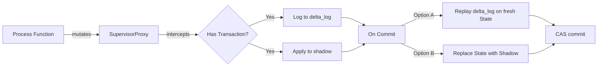
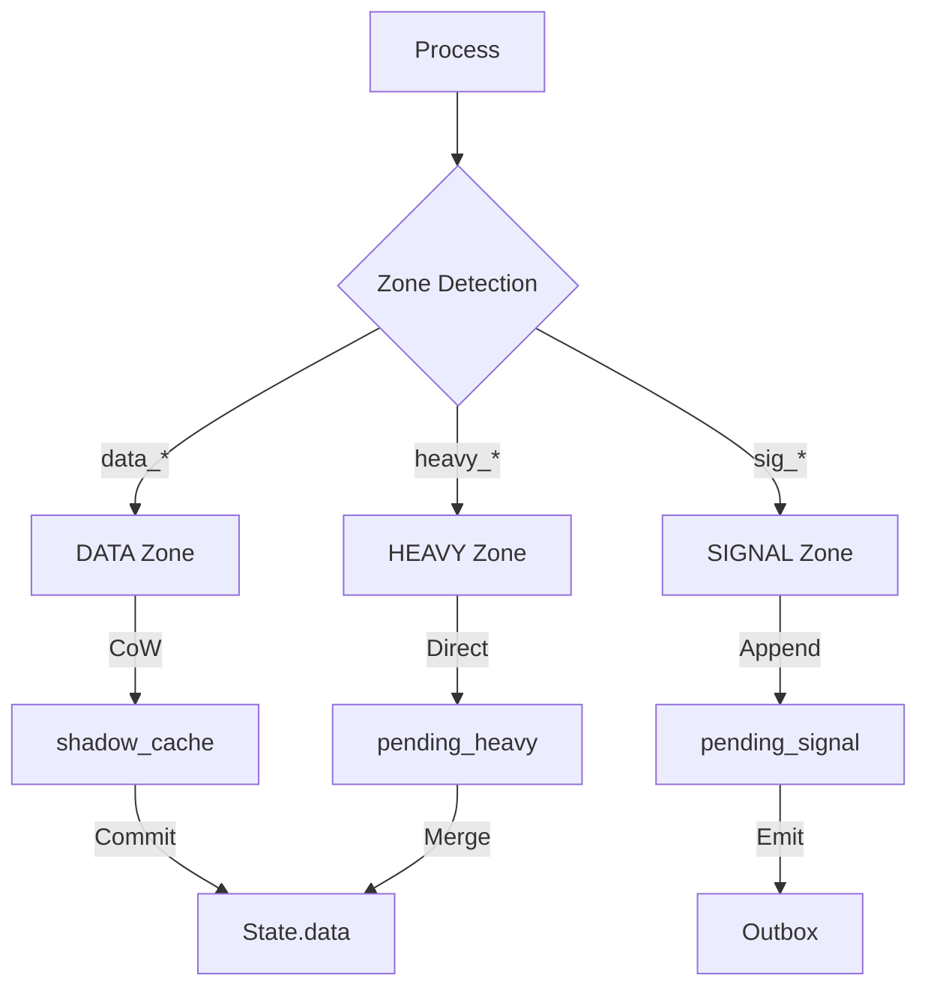

# 🧠 Phân Tích Chiến Lược: Delta Replay vs Full State Shadow

**Frameworks áp dụng:** 
- Integrative-Critical-Analysis (25-Point Checklist)
- Systems-Thinking-Engine (4-Phase Workflow)

---

## 🌐 SYSTEMS ANALYSIS SUMMARY

| Aspect | Option A: Delta Replay | Option B: Full State Shadow |
|--------|------------------------|------------------------------|
| **Scope** | Transaction-level mutation tracking | Process-level state isolation |
| **Dynamics** | Linear log-then-apply (B-loop) | Copy-on-entry, replace-on-commit (R-loop) |
| **Root Structure** | Event Sourcing pattern | Snapshot Isolation pattern |
| **Leverage Point** | `delta_log` accuracy | Shadow completeness |

---

## PHASE 1: BOUNDARY MAPPING

### Container (Hệ thống chứa)
```
┌─────────────────────────────────────────────────────────────┐
│                     TheusEngine                              │
│  ┌─────────────┐    ┌──────────────┐    ┌───────────────┐   │
│  │ Transaction │───▶│ ContextGuard │───▶│ Supervisor    │   │
│  │ (Shadow)    │    │ (Wrapper)    │    │ Proxy         │   │
│  └─────────────┘    └──────────────┘    └───────────────┘   │
│         │                                       │            │
│         ▼                 MUTATIONS             ▼            │
│  ┌─────────────┐                         ┌───────────────┐   │
│  │ delta_log   │◀────────────────────────│ state.data    │   │
│  │ path_to_    │                         │ (ORIGINAL)    │   │
│  │ shadow      │                         └───────────────┘   │
│  └─────────────┘                                             │
└─────────────────────────────────────────────────────────────┘
```

### Actors (Thành phần tương tác)
| Actor | Vai trò | State |
|-------|---------|-------|
| `Transaction` | Container cho pending mutations | Ephemeral |
| `delta_log` | Log các mutations theo path | Append-only |
| `shadow_cache` | Cache deepcopy objects | Keyed by object ID |
| `SupervisorProxy` | Intercept mutations | Stateless wrapper |
| `State.data` | Nguồn dữ liệu gốc | Persistent, versioned |

---

## PHASE 2: DYNAMIC ANALYSIS

### 2.1 Influence Flows



### 2.2 Feedback Loops

#### Option A: Delta Replay
```
┌─────────────────────────────────────────────────────┐
│                 BALANCING LOOP (B1)                  │
│                                                      │
│   delta_log.len() ─┬──▶ Replay Time ──▶ Commit      │
│         ▲          │         ▲         Latency      │
│         │          │         │                │      │
│         │          │    Complexity             │      │
│         │          │    (Nested Paths)         │      │
│         │          │         ▲                 │      │
│         │          └─────────┘                 │      │
│         │                                      │      │
│         └──────────────────────────────────────┘      │
│                    (Self-limiting)                   │
└─────────────────────────────────────────────────────┘

Trade-off: Nhiều mutations = replay chậm hơn
           Nhưng KHÔNG tăng memory usage theo state size.
```

#### Option B: Full State Shadow
```
┌─────────────────────────────────────────────────────┐
│                 REINFORCING LOOP (R1)                │
│                                                      │
│   State Size ──────▶ Shadow Size ──────▶ Memory     │
│       ▲                                    Usage     │
│       │                                      │       │
│       │              ┌───────────────────────┘       │
│       │              │                               │
│       │              ▼                               │
│       │         GC Pressure ──▶ Latency Spikes      │
│       │              │                               │
│       └──────────────┘                               │
│                    (Amplifying)                      │
└─────────────────────────────────────────────────────┘

Warning: State lớn = shadow lớn = memory leak potential!
```

### 2.3 Delays Analysis

| Delay Point | Option A | Option B |
|-------------|----------|----------|
| Process Start | Instant | **deepcopy() latency** (O(state_size)) |
| Mutation | **delta_log append** (O(1)) | Direct (O(1)) |
| Commit | **Replay latency** (O(n_mutations * depth)) | Replace (O(1) pointer swap) |
| Rollback | Discard log (O(1)) | Discard shadow (O(1)) |

---

## PHASE 3: STRUCTURAL EXCAVATION

### 3.1 The Root Problem (Q2, Q11)

> **CORE INSIGHT:** Vấn đề KHÔNG phải là "copy vs log" - mà là **"khi nào data được freeze?"**

Cả hai options đều giải quyết cùng một structural flaw:
- **Current flaw:** Shadow được tạo **incrementally** (per-access), tạo ra fragmented snapshots.
- **Option A fixes:** Không cần shadow coherent - chỉ cần delta sequence đúng.
- **Option B fixes:** Shadow coherent từ đầu (atomic snapshot).

### 3.2 Assumption Audit (Q5)

| Hidden Assumption | Option A Risk | Option B Risk |
|-------------------|---------------|---------------|
| "Mutations are independent" | ✅ Safe (path-based) | ✅ Safe (isolated) |
| "State is serializable" | ✅ Python objects | ⚠️ **deepcopy fails on some types** |
| "Order matters" | ⚠️ **Last-write-wins** | ✅ Natural order |
| "State fits in memory x2" | ✅ Only deltas | ❌ **FAILS for large states** |
| "No concurrent modifications" | ⚠️ Race conditions | ✅ Snapshot isolation |

### 3.3 Edge Cases (Q13)

#### Option A Breaking Point:
```python
# Scenario: Conflicting Path Resolution
state = {'users': [{'name': 'Alice'}, {'name': 'Bob'}]}

# Process 1 logs: users[0].name = 'Charlie'
# Process 2 logs: users[0] = {'name': 'Dave', 'age': 30}

# Replay order matters!
# If P1 commits first: users[0] = {'name': 'Dave', 'age': 30} (P1's change lost)
# If P2 commits first: users[0].name = 'Charlie' (P1's change wins, age=30 lost)
```
**Risk Level:** 🟡 Medium (detectable via path conflict check)

#### Option B Breaking Point:
```python
# Scenario: Large State Memory Explosion
state = {
    'model_weights': np.zeros((10000, 10000)),  # 800MB
    'cache': {...}  # 500MB
}

# Transaction created: deepcopy(state) -> +1.3GB memory
# With 10 concurrent transactions: 13GB memory spike!
```
**Risk Level:** 🔴 High (silent OOM in production)

---

## PHASE 4: LEVERAGE & SIMULATION

### 4.1 Critical Questions Answered

| Question | Option A | Option B |
|----------|----------|----------|
| **Q19 (Effectiveness):** Solves original purpose? | ✅ Yes, mutations tracked | ✅ Yes, isolation achieved |
| **Q20 (Resilience):** Handles edge cases? | 🟡 Need conflict detection | ❌ Memory risk |
| **Q21 (Adaptability):** Easy to extend? | ✅ Add more delta types | 🟡 Fixed pattern |
| **Q22 (Fallback):** Failure plan? | Log truncation | GC pressure |
| **Q23 (Flow):** Leveraging or forcing? | ⚡ **Leverages** existing log system | 🔧 Forces copy overhead |
| **Q25 (Harmony):** Creates future debt? | 🟡 Ordering complexity | 🔴 **Memory architecture debt** |

### 4.2 2nd-Order Effects Simulation

```
If we implement Option A:
├── (+) delta_log already exists and works
├── (+) No memory overhead per transaction
├── (+) Audit/replay capabilities for debugging
├── (-) Need to implement path conflict detection
└── (-) Need to implement set_nested_value correctly

If we implement Option B:
├── (+) Conceptually simpler (snapshot-restore)
├── (+) Natural conflict isolation
├── (-) EmotionAgent uses large numpy arrays -> MEMORY EXPLOSION
├── (-) deepcopy fails on some objects (locks, file handles)
└── (-) Must add custom __deepcopy__ to all domain objects
```

---

## 📊 FINAL VERDICT

### The Trap (Q5, Q10)
> **FALSE ASSUMPTION:** "Full isolation requires full copy."
> 
> This is a trap from database MVCC thinking. In Theus, we have **observed paths** via Proxy - we KNOW exactly what was touched.

### The Truth (Q3, Q9)
> **REALITY:** EmotionAgent runs SNN simulations with 100MB+ state objects. Option B would double memory on every transaction.

### Strategic Path

```
┌─────────────────────────────────────────────────────────────┐
│                    RECOMMENDATION                            │
│                                                              │
│   ⚡ OPTION A: DELTA REPLAY (with enhancements)             │
│                                                              │
│   Reasons:                                                   │
│   1. Fits existing architecture (delta_log exists)          │
│   2. Memory-safe for large state (EmotionAgent SNN)         │
│   3. Provides audit trail (debugging/replay)                │
│   4. Aligns with POP philosophy (Process→Delta→State)       │
│                                                              │
│   Required Enhancements:                                     │
│   □ Implement robust set_nested_value (handle [idx] paths)  │
│   □ Add conflict detection (same path, different values)    │
│   □ Add delta timestamp for ordering                         │
└─────────────────────────────────────────────────────────────┘
```

### Evolution Path (Q24)
```
Phase 1: Delta Replay (Now)
    ↓
Phase 2: Conflict Detection (When needed)
    ↓
Phase 3: Hybrid (Option B for small state, Option A for large)
```

---

## Implementation Checklist

- [ ] Implement `apply_delta_to_state(state, delta_log)` in Rust
- [ ] Handle nested paths: `domain.users[0].name`
- [ ] Add `delta.timestamp` field
- [ ] Update `get_shadow_updates()` → `build_pending_from_deltas()`
- [ ] Test with rollback scenarios
- [ ] Benchmark memory usage vs Option B

---

**Analysis completed using:**
- Integrative-Critical-Analysis: Q2, Q3, Q5, Q9, Q11, Q13, Q19-Q25
- Systems-Thinking-Engine: All 4 phases

---

# 🔄 ADDENDUM: Heavy Zone & Shared Memory Impact

## Hiện trạng Heavy Zone trong Theus

```rust
// zones.rs
pub fn resolve_zone(key: &str) -> ContextZone {
    if key.starts_with("heavy_") {
        return ContextZone::Heavy;  // Skip copy!
    }
    // ...
}

// engine.rs - get_shadow()
if resolve_zone(leaf) == ContextZone::Heavy {
    println!("[Theus] get_shadow HEAVY SKIP: {}", p);
    cache.insert(id, (val, val.clone_ref(py)));  // SAME object!
    return Ok(val);  // NO COPY
}
```

### Key Insight: Theus đã implement HYBRID Architecture!

```
┌─────────────────────────────────────────────────────────────────┐
│                    THEUS STATE ZONES                             │
│                                                                  │
│  ┌───────────────────────────────────────────────────────────┐  │
│  │ DATA ZONE (default)                                       │  │
│  │ - Objects: domain, config, etc.                           │  │
│  │ - Behavior: Copy-on-Write (deepcopy)                      │  │
│  │ - Commit: via pending_data                                │  │
│  │ - Rollback: discard shadow                                │  │
│  └───────────────────────────────────────────────────────────┘  │
│                                                                  │
│  ┌───────────────────────────────────────────────────────────┐  │
│  │ HEAVY ZONE (heavy_* prefix)                               │  │
│  │ - Objects: heavy_weights, heavy_cache, heavy_buffer       │  │
│  │ - Behavior: Direct Reference (NO copy)                    │  │
│  │ - Commit: via pending_heavy                               │  │
│  │ - Rollback: ⚠️ NOT POSSIBLE (mutations are immediate)     │  │
│  └───────────────────────────────────────────────────────────┘  │
│                                                                  │
│  ┌───────────────────────────────────────────────────────────┐  │
│  │ SIGNAL ZONE (sig_*, cmd_*)                                │  │
│  │ - Objects: sig_update, cmd_restart                        │  │
│  │ - Behavior: Append-only log                               │  │
│  │ - Commit: via pending_signal (list)                       │  │
│  │ - Rollback: discard signal entries                        │  │
│  └───────────────────────────────────────────────────────────┘  │
└─────────────────────────────────────────────────────────────────┘
```

---

## Revised Analysis: Impact on Options

### Option A (Delta Replay) + Heavy Zone

```
┌─────────────────────────────────────────────────────────────┐
│ SCENARIO: Process mutates both data and heavy zones         │
│                                                              │
│ @process                                                     │
│ def train_step(ctx):                                         │
│     ctx.domain.data.metrics['loss'] = 0.5    # DATA zone    │
│     ctx.heavy_weights[0] = updated_tensor     # HEAVY zone  │
│                                                              │
│ ─────────────────────────────────────────────────────────── │
│ With Delta Replay:                                           │
│                                                              │
│ delta_log = [                                                │
│     DeltaEntry(path="domain.data.metrics[loss]", val=0.5),  │
│     # NO ENTRY for heavy_weights (direct mutation!)          │
│ ]                                                            │
│                                                              │
│ Commit:                                                      │
│   1. Replay delta_log to state.data ✅                       │
│   2. heavy_weights already mutated (no action needed)        │
│                                                              │
│ Rollback:                                                    │
│   1. Discard delta_log ✅                                    │
│   2. heavy_weights: ⚠️ CANNOT ROLLBACK!                      │
└─────────────────────────────────────────────────────────────┘
```

**Impact:** Heavy Zone mutations are **already committed** before process ends. Rollback only affects DATA zone.

### Option B (Full State Shadow) + Heavy Zone

```
┌─────────────────────────────────────────────────────────────┐
│ SCENARIO: Same process                                       │
│                                                              │
│ With Full State Shadow:                                      │
│                                                              │
│ shadow = deepcopy(state)                                     │
│   - shadow.data = COPY ✅                                    │
│   - shadow.heavy_weights = SKIP (same reference)             │
│                                                              │
│ Process mutates:                                             │
│   - shadow.data.metrics['loss'] = 0.5  (isolated)            │
│   - ctx.heavy_weights[0] = tensor      (DIRECT to original!) │
│                                                              │
│ Commit:                                                      │
│   - Replace state.data with shadow.data ✅                   │
│   - heavy_weights already updated                            │
│                                                              │
│ Rollback:                                                    │
│   - Discard shadow ✅                                        │
│   - heavy_weights: ⚠️ CANNOT ROLLBACK!                       │
└─────────────────────────────────────────────────────────────┘
```

**Impact:** Option B has **SAME limitation** as Option A for Heavy Zone!

---

## 🔑 Critical Realization

> **Both options have identical behavior for Heavy Zone objects!**
> 
> Heavy Zone is explicitly designed for **"write-through"** semantics where:
> - Performance > Isolation
> - User accepts NO rollback guarantee
> - ML tensors are too large for atomic snapshots

### Revised Comparison Matrix

| Criterion | Option A (Delta Replay) | Option B (Full Shadow) |
|-----------|-------------------------|-------------------------|
| **Data Zone** | Replay deltas | Replace with shadow |
| **Heavy Zone** | SAME (direct mutation) | SAME (direct mutation) |
| **Rollback - Data** | ✅ Discard log | ✅ Discard shadow |
| **Rollback - Heavy** | ❌ Impossible | ❌ Impossible |
| **Memory - Data** | O(n_mutations) | O(data_zone_size) |
| **Memory - Heavy** | O(1) reference | O(1) reference |

---

## Updated Recommendation

```
┌─────────────────────────────────────────────────────────────┐
│                 REVISED RECOMMENDATION                       │
│                                                              │
│ ⚡ OPTION A (Delta Replay) remains BETTER because:          │
│                                                              │
│ 1. Heavy Zone behavior is IDENTICAL in both options         │
│ 2. Data Zone in Option A uses LESS memory                   │
│ 3. Delta Replay provides AUDIT TRAIL                        │
│ 4. Aligns with existing delta_log infrastructure            │
│                                                              │
│ Option B provides NO ADDITIONAL SAFETY for Heavy Zone       │
│ while consuming MORE memory for Data Zone.                  │
│                                                              │
└─────────────────────────────────────────────────────────────┘
```

### Architectural Insight: Theus's 3-Zone Design



### Trade-off by Zone

| Zone | Safety | Performance | Use Case |
|------|--------|-------------|----------|
| DATA | ⭐⭐⭐⭐⭐ Full isolation | ⭐⭐⭐ Copy overhead | Domain logic, configs |
| HEAVY | ⭐⭐ No rollback | ⭐⭐⭐⭐⭐ Zero copy | ML weights, large arrays |
| SIGNAL | ⭐⭐⭐⭐ Append-only | ⭐⭐⭐⭐⭐ Fast emit | Events, commands |

---

## Conclusion for EmotionAgent

EmotionAgent's SNN weights are stored in `heavy_*` zone → **NO ROLLBACK POSSIBLE by design**.

This means:
1. ✅ Option A is still preferred for Data Zone
2. ✅ Heavy Zone works correctly (no memory explosion)
3. ⚠️ SNN mutations are "fire and forget" - intentional trade-off
4. 💡 If SNN rollback needed → move to Data Zone (accept copy cost)

