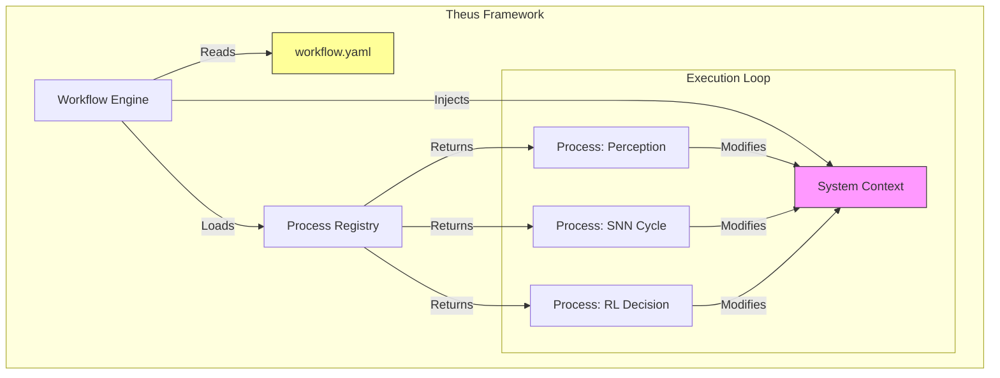
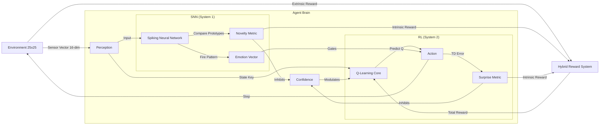
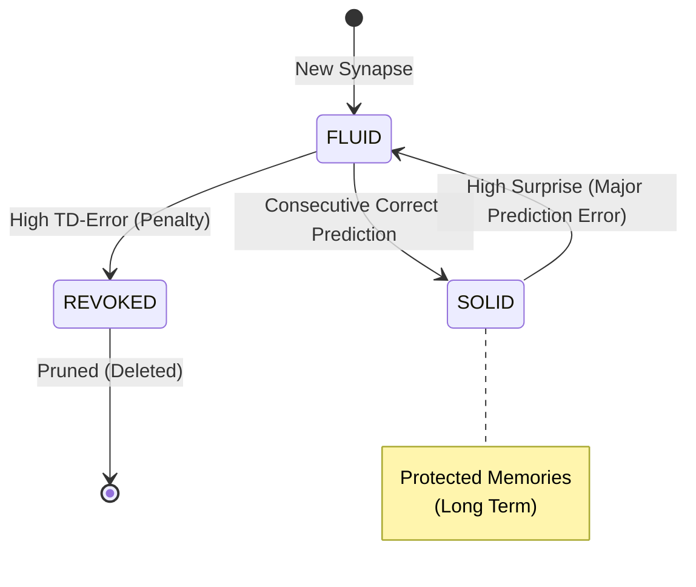
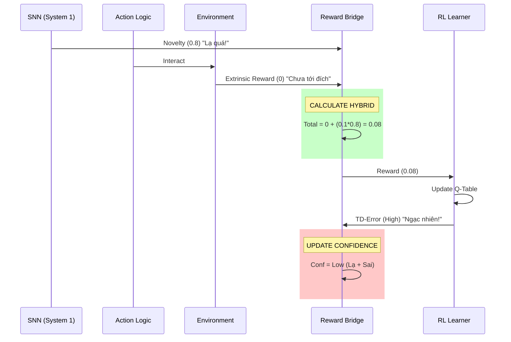
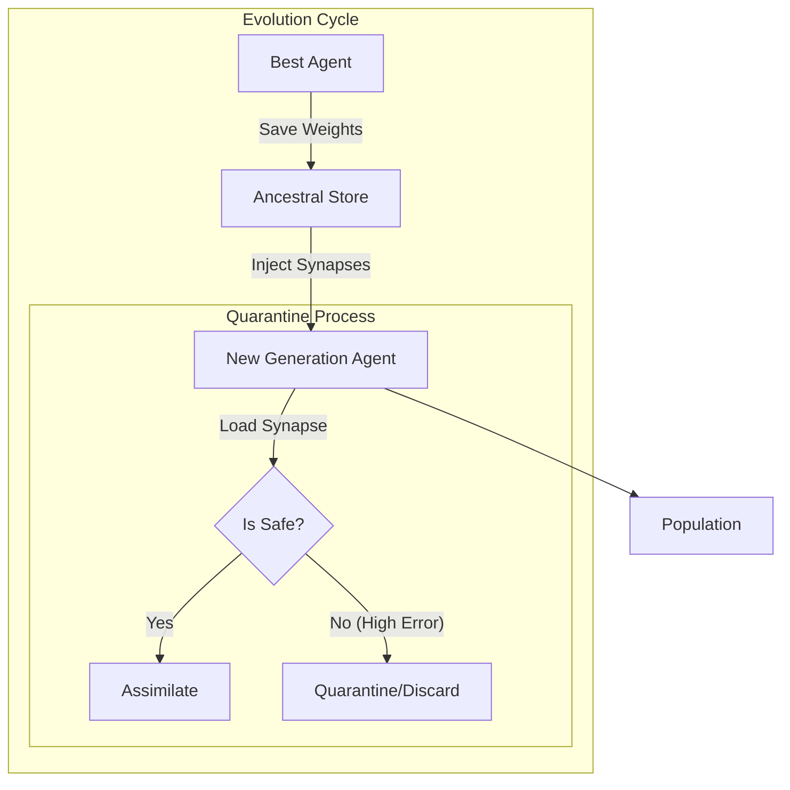

# DeepSearch EmotionAgent: Architectural Specification 2026

**Date:** 2026-01-13
**Version:** Phase 16 (Hybrid Reward & Meta-Cognition)
**Author:** Do Huy Hoang & Antigravity (Assistant)

---

## 1. Triết lý Thiết kế: POP & Theus Framework
Dự án được xây dựng trên nền tảng **Process-Oriented Programming (POP)**, sử dụng framework **Theus**. Khác với OOP truyền thống (nơi dữ liệu và hành vi bị đóng gói cùng nhau), POP tách biệt hoàn toàn chúng.

### 1.1 Nguyên lý Cốt lõi
1.  **Context (Dữ liệu):** Là các cấu trúc "câm" (Dictionaries/Dataclasses), chứa toàn bộ trạng thái của Agent và Môi trường.
2.  **Process (Hành vi):** Là các hàm thuần túy (Pure Functions) biến đổi Context.
3.  **Workflow (Luồng):** File YAML định nghĩa thứ tự gọi các Process.

### 1.2 Theus Orchestration Diagram

---

## 2. Kiến trúc Nhận thức Tổng thể (Cognitive Architecture)
EmotionAgent sử dụng mô hình **Dual-Process Theory** (Lý thuyết xử lý kép), kết hợp giữa mạng xung thần kinh (SNN) và học tăng cường (RL).

*   **Hệ thống 1 (SNN):** Nhanh, trực giác, xử lý Novelty (Sự mới lạ) và Cảm xúc.
*   **Hệ thống 2 (RL):** Chậm, logic, tối ưu hóa phần thưởng (Q-Learning).
*   **Cầu nối (Bridge):** Gated Attention Network & Hybrid Reward.

### 2.1 Agent Flow Diagram

---

## 3. Các Cơ chế Chuyên sâu (Deep Mechanisms)

### 3.1 Neural Darwinism (Tiến hóa Thần kinh)
Hệ thống không train theo kiểu Backprop (cập nhật trọng số toàn mạng). Nó train theo kiểu **Chọn lọc Tự nhiên** từng Synapse.

*   **Fluid Synapse:** Liên kết mới, dễ thay đổi (dễ học, dễ quên).
*   **Solid Synapse:** Liên kết đã được kiểm chứng (TD-Error thấp liên tiếp). Khó thay đổi, bảo vệ ký ức.
*   **Pruning:** Synapse vô dụng (TD-Error cao) bị cắt bỏ.

### 3.2 Hybrid Reward & Meta-Cognition (Phase 16)
Cơ chế giải quyết vấn đề "Sparse Reward".

*   **Công thức:** $R_{total} = R_{extrinsic} + (w_1 \times Novelty) + (w_2 \times |TD\_Error|)$
*   **Confidence (Tự tin):** $EMA((1 - Novelty) \times e^{-|TD|})$.

### 3.3 Dreaming (Giấc Mơ & Cân bằng Nội môi)
Khi không có Input (Sleep Mode), SNN tự kích hoạt ngẫu nhiên để củng cố ký ức.

*   **Coherence Check:** Đếm tỷ lệ neuron bắn xung ($Rate$).
*   **Reward:**
    *   $Rate \in [5\%, 30\%]$: Thưởng (+0.1) $\rightarrow$ Củng cố đường truyền ổn định.
    *   $Rate > 40\%$: Phạt (-0.5) $\rightarrow$ Ức chế đường truyền gây động kinh.
    *   $Rate < 5\%$: Phạt (-0.2) $\rightarrow$ Kích thích đường truyền chết.

---

## 4. Động lực học Tập thể (Collective/Evolutionary)
Hệ thống hỗ trợ Multi-Agent training thông qua cơ chế **Ancestral Memory Assimilation** (Đồng hóa Ký ức Tổ tiên).

### 4.1 Viral Learning (Học tập lây lan)
Tương tự như Virus, một Agent tìm ra đường đi đúng (Goal) sẽ "lây lan" kiến thức đó (Synapse trọng số cao) sang các Agent khác thông qua cơ chế `process_inject_viral`.
*   **Quarantine:** Để tránh lây lan "kiến thức độc hại" (phần thưởng ảo), mỗi kiến thức nạp vào phải trải qua quy trình kiểm tra (Quarantine Validation) trong môi trường Sandbox ảo trước khi được chấp nhận vào não bộ chính.
