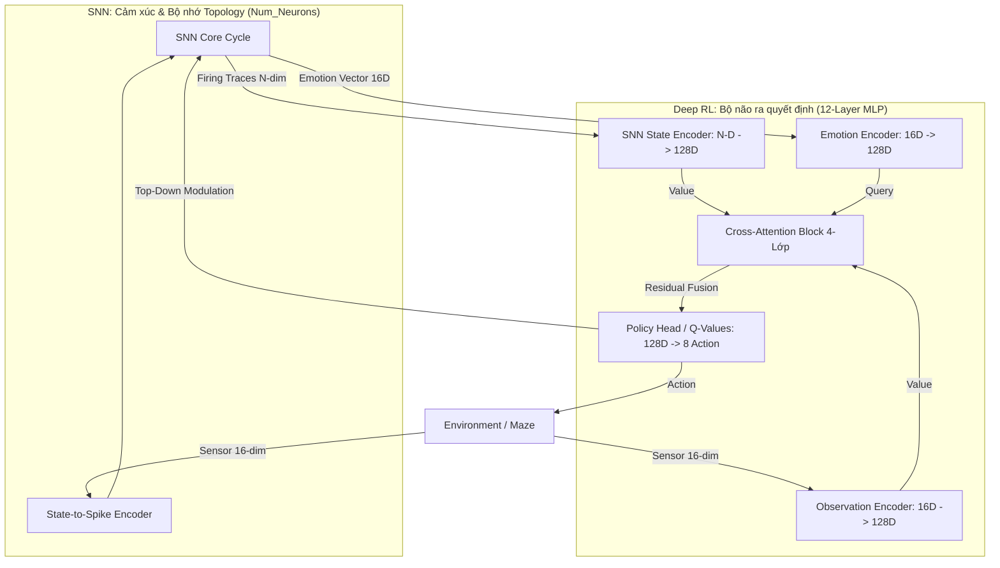

# Kiến trúc Hệ thống EmotionAgent V3: NEURAL BRAIN 🧠

Tài liệu này đặc tả kiến trúc "Neural Brain" - bước tiến hóa từ mô hình học máy dạng bảng (Tabular RL) sang mô hình học máy sâu (Deep RL) tích hợp cảm xúc thần kinh (SNN).

## 1. Triết lý Thiết kế: Bio-Inspired Deep RL

Thay vì sử dụng một mạng thần kinh đơn lẻ, EmotionAgent sử dụng một hệ thống **Lưỡng hợp (Hybrid)**:
- **Spiking Neural Network (SNN):** Đóng vai trò là "Hệ thống Cảm xúc & Bộ nhớ thời gian". Nó quản lý tính động học, sự tích lũy kinh nghiệm qua dòng thời gian.
- **Deep Neural Network (MLP + Attention):** Đóng vai trò là "Bộ não ra quyết định". Nó tối ưu hóa các phản xạ hành động dựa trên bối cảnh hiện tại.

## 2. Luồng Tương tác Hai chiều (Bidirectional Loop)

Kiến trúc này thiết lập một vòng lặp phản hồi chặt chẽ giữa hai hệ thống:

### A. Bottom-Up Influence (SNN → RL)
1. **Gated Attention:** Vector cảm xúc từ SNN không chỉ là đầu vào thô. Nó đóng vai trò là một **Layer Norm/Gating** (Màn lọc).
2. **Feature Weighting:** Thông qua cơ chế **Cross-Attention**, cảm xúc sẽ ra lệnh cho bộ não RL phải "tập trung" vào kênh cảm biến nào (Ví dụ: Khi ở trạng thái *Sợ hãi*, hãy ưu tiên kênh *Va chạm Chướng ngại vật*).
3. **Intrinsic Reward:** SNN cung cấp phần thưởng nội tại (Novelty) giúp RL vượt qua các trạng thái bế tắc của môi trường.

### B. Top-Down Control (RL → SNN)
1. **State Injection:** RL chuyển hóa dữ liệu môi trường thành các xung điện (Spikes) để nuôi dưỡng sự phát triển của SNN.
2. **Attention Modulation:** Hành động cuối cùng của RL (`last_action`) được gửi ngược lại SNN để điều chỉnh ngưỡng kích hoạt (Threshold) của các vùng neuron tương ứng. Điều này mô phỏng sự tập trung có ý thức của sinh vật vào các hướng di chuyển mục tiêu.

## 3. Cơ chế Neural Brain (Deep RL)

### Tại sao sử dụng MLP + Cross-Attention thay vì RNN?
Chúng ta chọn MLP vì **Sự phân công lao động**:
- **Tính Hồi quy (Recurrence/Memory):** Đã được SNN đảm nhận hoàn hảo. Việc thêm một lớp RNN (LSTM/GRU) vào RL sẽ gây dư thừa và nhiễu tín hiệu (Signal Noise).
- **Tính Phản xạ (Policy):** MLP phối hợp với Attention cung cấp tốc độ suy luận nhanh và khả năng hội tụ ổn định hơn trên nền tảng bối cảnh mà SNN đã tổng hợp.

### Sơ đồ Kiến trúc



## 4. Giải phẫu Mạng Quyết định (Gated Integration Network)

Sau đại tu cấu trúc (Bridge Upgrade), mạng Neural Brain không hề đơn giản, mà là một cỗ máy phân tích Multi-branch đồ sộ bao gồm tổng cộng **12 Lớp Nơ-ron (Layers)** truyền thẳng:

1.  **3 Bộ Mã hóa Song song (6 Lớp):** Môi trường (16D), SNN Trạng thái (N-Dim), và SNN Cảm xúc (16D) được tách riêng và mỗi kênh đi qua 2 lớp tuyến tính để phóng chiều lên `hidden_dim` (Ví dụ 128) để tạo không gian đặc trưng chung.
2.  **Khối Chú ý Chéo (Cross-Attention - 4 Lớp) - Sự Thay Đổi Bản Lề:** 
    Sự Tiến hóa ở đây nằm ở việc thay đổi mục tiêu mà Cảm xúc rọi vào (Query vs Key/Value):
    *   *Trong phiên bản cũ:* Mạng dùng Cảm xúc nén (16D) rọi vào Cảm biến Môi trường (16D). Nhược điểm là tác tử mù lòa về không gian sâu và độ dài ký ức. 
    *   *Trong phiên bản V3 hiện tại:* Thuật toán hợp nhất (Addition Fusion) Mảnh ghép Không gian (Môi trường) và Mảnh ghép Thời gian (Mảng SNN Ký ức 100D+) lại thành một Căn phòng duy nhất. Vector Cảm xúc (16D) lúc này đóng vai trò như một **Chiếc đèn pin Chỉ hướng** soi vào Tổ hợp Không-Thời gian đó để nhận thức: *"Trong hàng trăm nơ-ron đang nháy sáng phức tạp kia, đâu là nhịp điệu cốt lõi sinh ra cảm giác sợ hãi này? Và tôi nên phản ứng ra sao?"*. Cơ chế này mang lại khả năng Lập luận (Reasoning) vô tiền khoáng hậu cho hệ thống RL.
3.  **Khối Hành động (Q-Head - 2 Lớp):** Tín hiệu sau chú ý được gộp lại qua Layer Norm và điền vào 2 lớp suy luận sâu để đánh giá Q-value cho 8 hành động độc lập.

Sự chia nhánh này giúp hệ thống nhận diện bức tranh tổng thể đa chiều $1000+$ cảm biến (khi SNN scale-up) mà không bị Nghẽn Cổ chai (Information Bottleneck) hay Suy thoái (Catastrophic Forgetting).

## 5. Phá vỡ Nút thắt Cổ chai (SNN-DeepRL Interface)

Trước khi nâng cấp, cầu nối dữ liệu (Bridge) giữa SNN và các hệ thống RL (kể cả Bảng Q-Table lẫn Mạng MLP sơ khai) đều tồn tại một yếu huyệt tàn khốc: **Nén trung bình (Average Pooling) thành 16-chiều**.

### Vấn đề của Kiến trúc cũ
Dù mạng SNN có sở hữu 100 hay 1000 nơ-ron với mạng lưới Topology phân tán tới đâu, khi đi qua `encode_emotion_vector`, hệ thống đều lấy tất cả các nơ-ron đang nháy sáng (Active Firing) cộng gộp lại và chia trung bình để nhồi nhét vào một Vector Cảm xúc 16-chiều (Emotion Vector 16D). Quá trình "Information Collapse" này khiến mạng PyTorch phía sau bị mù lòa không gian: Nó không thể biết nơ-ron nào ở phương hướng nào đang chớp sáng, mà chỉ thấy một màn sương mờ mờ 16-chiều nhạt nhòa. Điều này khiến cho Reward bị kẹt cứng triền miên ở mức âm do trạng thái môi trường bị trùng lặp (Aliasing).

### Giải pháp Truyền thẳng V3 (Raw State Injection)
Trong phiên bản **12-Layer MLP** hiện tại, nút thắt 16D này đã bị bãi bỏ. Bầu trời dữ liệu được khai mở hoàn toàn:
- Mạng SNN giờ đây cung cấp **nguyên trạng toàn bộ Mảng trạng thái nháy sáng (Firing Traces Array)**. Nếu SNN có $N$ Nơ-ron, một khối dữ liệu $N$-chiều (`snn_state_dim`) sẽ được bơm thẳng xuống PyTorch.
- Mảng Firing Traces này chứa đựng trọn vẹn đặc trưng Không gian - Thời gian (Biết biến cố xảy ra ở đâu và bao lâu trước đó).
- Emotion Vector 16D cũ giờ đây thoái lui, chỉ còn đóng vai trò phụ trợ làm `Query` (Hệ giá trị mong muốn) để hệ thống Cross-Attention (Phễu Chú ý) biết rằng **"Nên chú ý vào vùng nào của Mảng 100D Firing Traces kia"**.

## 6. Cơ chế Tự động Co giãn (Auto-Scaling Dimensionality)

Kiến trúc SNN-DeepRL được thiết kế theo triết lý "Plug-and-Play". Bạn hoàn toàn có thể thổi phồng bộ não SNN lên 1,024 hay 10,240 Nơ-ron (để đạt quy mô sinh học thực sự) mà **không cần sửa một dòng Code Python nào**.

### Hướng dẫn Cấu hình (JSON)
Mọi việc điều phối kích thước cổng giao tiếp đều nằm trong file cấu hình (ví dụ `experiments.json`). Bạn chỉ cần đảm bảo sự đồng bộ giữa Tổng số Nơ-ron SNN và Đầu vào MLP:

```json
{
    "snn_config": {
        "num_neurons": 1024
    },
    "model_config": {
        "snn_state_dim": 1024,
        "hidden_dim": 256
    }
}
```

### Nguyên tắc chọn Kích thước Lớp ẩn (hidden_dim)
Khi bạn bơm $N$ tín hiệu đầu vào từ SNN, Mạng ẩn (Hidden Layer) của RL không được phép nhỏ bé. Cần thiết lập `hidden_dim` theo "Quy tắc Cổ chai Vàng" (Tỷ lệ 1/2 hoặc 1/4 so với dữ liệu đầu vào):
*   **Scale vừa phải (1,024 Neurons):** Đặt `hidden_dim` = `256`. PyTorch sẽ tự sinh ra một bộ giải mã (Encoder) có $1024 \times 256 = 262,400$ tham số. Đủ để chắt lọc quy luật mà hệ thống vẫn chạy rất nhẹ trên Laptop.
*   **Scale khổng lồ (10,240 Neurons):** Đặt `hidden_dim` = `512` (hoặc 1024). Bộ giải mã sẽ phình to thành hàng triệu tham số. Khả năng nhìn thấu Mê cung Rộng lớn sẽ xấp xỉ vô cực, nhưng bù lại mỗi vòng lặp `train_step` sẽ cực kỳ ngốn tài nguyên CPU/GPU.

*Nhờ cơ chế **Layer Normalization** chặn hai đầu, bạn có thể truyền ma trận 10,240 chiều vào hệ thống Attention mà không bao giờ gặp lỗi Gradients bùng nổ (Exploding).*

## 7. Lợi ích của việc gỡ bỏ Tabular Q-Learning

Việc chuyển hoàn toàn sang Neural Brain giải quyết các vấn đề cốt lõi:
- **Hóa giải "Bùng nổ trạng thái":** Không còn giới hạn bởi bảng tọa độ (X, Y). Mạng Neural có thể xử lý các trạng thái môi trường liên tục và phức tạp.
- **Thấu hiểu Logic Cổng/Công tắc:** Vì sensor 16-dim bao hàm trạng thái cổng và âm thanh, mạng Neural có thể học được mối quan hệ nhân quả (Bật công tắc -> Cổng mở) thay vì chỉ nhớ vị trí địa lý.
- **Tính đa năng:** Hệ thống có thể thích nghi với các mê cung có kích thước và quy luật khác nhau mà không cần reset lại cấu trúc dữ liệu.

---

## 6. Quy hoạch Tái cấu trúc (Refactor Roadmap)

Để hiện thực hóa kiến trúc Neural Brain, chúng ta cần thực hiện tái cấu trúc tại các điểm can thiệp sau:

### A. Core Data Structures
- **File**: [`src/core/context.py`](file:///C:/Users/dohoang/projects/EmotionAgent/src/core/context.py)
- **Tác động**: 
    - Đánh dấu `heavy_q_table` là deprecated.
    - Đảm bảo `heavy_gated_network` và `heavy_gated_optimizer` luôn được khởi tạo trong `RLAgent`.

### B. Hành động & Suy luận (Inference)
- **File**: [`src/processes/rl_processes.py`](file:///C:/Users/dohoang/projects/EmotionAgent/src/processes/rl_processes.py)
- **Can thiệp**: 
    - Hàm `select_action_gated`: Gỡ bỏ nhánh rẽ `if ctx.domain_ctx.heavy_gated_network is not None`. Mạng Neural sẽ là con đường duy nhất.
    - Xử lý mặc định: Nếu vector cảm xúc từ SNN chưa có (None), tạo Zero-Tensor 16-dim để đưa vào mạng thay vì nhảy về Tabular.

### C. Logic Học tập (Learning)
- **File**: [`src/processes/rl_processes.py`](file:///C:/Users/dohoang/projects/EmotionAgent/src/processes/rl_processes.py)
- **Can thiệp**: 
    - Hàm `update_q_learning`: Gỡ bỏ toàn bộ logic tính toán và cập nhật vào mảng Python `full_q_table`. 
    - Chuyển trọng tâm sang huấn luyện `MSELoss` giữa `current_q_val` và `target_q_val` thông qua `Backpropagation`.

### D. Đo lường & Giám sát (Metrics)
- **Files**: 
    - [`src/agents/rl_agent.py`](file:///C:/Users/dohoang/projects/EmotionAgent/src/agents/rl_agent.py)
    - [`src/orchestrator/processes/p_enrich_metrics.py`](file:///C:/Users/dohoang/projects/EmotionAgent/src/orchestrator/processes/p_enrich_metrics.py)
- **Thay đổi**: 
    - Loại bỏ chỉ số `q_table_size` (vốn gây nhầm lẫn về quy mô bộ nhớ).
    - Thêm chỉ số `avg_q_value` hoặc `last_loss` để theo dõi sự ổn định của mạng Neural.

### E. Lưu trữ (Persistence)
- **File**: [`src/utils/snn_persistence.py`](file:///C:/Users/dohoang/projects/EmotionAgent/src/utils/snn_persistence.py)
- **Nâng cấp**: 
    - Thay vì lưu `q_table` dạng JSON (rất nặng và thưa), chúng ta sẽ lưu `state_dict` của `heavy_gated_network` bằng `torch.save`.

---

## 7. Bảng Đánh giá Tác động Chi tiết (Impact Assessment)

Dưới đây là bảng phân loại các cơ chế hiện hữu và mức độ ảnh hưởng khi chuyển đổi sang Neural Brain.

| Cơ chế hệ thống | Trạng thái | Chi tiết tác động |
| :--- | :--- | :--- |
| **SNN Cycle & STDP** | 🟢 **Không đổi** | Các quy luật vật lý của nơ-ron, sự học tập khớp thần kinh và nhịp sinh học vẫn giữ nguyên. |
| **Top-Down Attention** | 🟢 **Không đổi** | Phản hồi từ RL để điều chỉnh ngưỡng nơ-ron vẫn hoạt động dựa trên hành động đầu ra. |
| **Darwinism & Homeostasis** | 🟢 **Không đổi** | Các cơ chế tiến hóa và tự cân bằng của SNN không bị ảnh hưởng. |
| **Sensor Perception** | 🟢 **Không đổi** | Dữ liệu đầu vào vẫn là 16 chiều (đã được quy hoạch từ trước). |
| **Intrinsic Reward** | 🟡 **Giữ nguyên logic** | SNN vẫn tính Novelty, nhưng tín hiệu này giờ đây sẽ được dùng để tối ưu hóa mạng Neural. |
| **Emotion Gating** | 🔵 **Cường hóa** | Từ chỗ chỉ là một biến số điều chỉnh Epsilon, nay trở thành **Bộ lọc Attention** trực tiếp cho bộ não. |
| **Q-Value Learning** | 🔴 **Thay thế hoàn toàn** | Gỡ bỏ việc cập nhật mảng Python (Tabular); thay bằng tính toán Loss và SGD (Stochastic Gradient Descent). |
| **Hệ thống Metrics** | 🔴 **Tái cấu trúc** | Xóa bỏ `q_table_size`, thay bằng `Network_Loss` và `Inference_Confidence`. |
| **Lưu trữ (Persistence)** | 🔴 **Thay thế định dạng** | Chuyển từ định dạng JSON (cho Q-Table) sang định dạng Binary `.pt` (cho Neural Weights). |

---
**Kết luận:** Quá trình chuyển đổi tập trung vào việc thay thế "động cơ ra quyết định" (Decision Engine) nhưng vẫn bảo toàn tuyệt đối "hệ thống cảm giác" (Sensory) và "trung tâm cảm xúc" (SNN). Điều này đảm bảo tính kế thừa và không làm hỏng các thành quả huấn luyện SNN trước đó.
