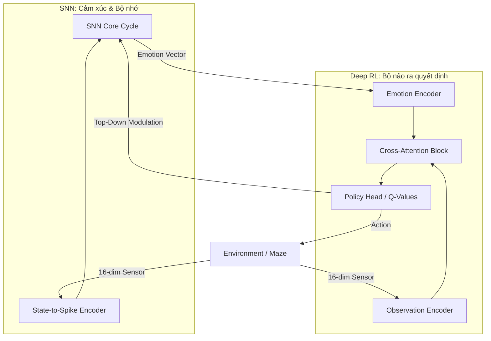

# Kiến trúc Hệ thống EmotionAgent V3: NEURAL BRAIN 🧠

Tài liệu này đặc tả kiến trúc "Neural Brain" - bước tiến hóa từ mô hình học máy dạng bảng (Tabular RL) sang mô hình học máy sâu (Deep RL) tích hợp cảm xúc thần kinh (SNN).

## 1. Triết lý Thiết kế: Bio-Inspired Deep RL

Thay vì sử dụng một mạng thần kinh đơn lẻ, EmotionAgent sử dụng một hệ thống **Lưỡng hợp (Hybrid)**:
- **Spiking Neural Network (SNN):** Đóng vai trò là "Hệ thống Cảm xúc & Bộ nhớ thời gian". Nó quản lý tính động học, sự tích lũy kinh nghiệm qua dòng thời gian.
- **Deep Neural Network (MLP + Attention):** Đóng vai trò là "Bộ não ra quyết định". Nó tối ưu hóa các phản xạ hành động dựa trên bối cảnh hiện tại.

## 2. Luồng Tương tác Hai chiều (Bidirectional Loop)

Kiến trúc này thiết lập một vòng lặp phản hồi chặt chẽ giữa hai hệ thống:

### A. Bottom-Up Influence (SNN → RL)
1. **Gated Attention:** Vector cảm xúc từ SNN không chỉ là đầu vào thô. Nó đóng vai trò là một **Layer Norm/Gating** (Màn lọc).
2. **Feature Weighting:** Thông qua cơ chế **Cross-Attention**, cảm xúc sẽ ra lệnh cho bộ não RL phải "tập trung" vào kênh cảm biến nào (Ví dụ: Khi ở trạng thái *Sợ hãi*, hãy ưu tiên kênh *Va chạm Chướng ngại vật*).
3. **Intrinsic Reward:** SNN cung cấp phần thưởng nội tại (Novelty) giúp RL vượt qua các trạng thái bế tắc của môi trường.

### B. Top-Down Control (RL → SNN)
1. **State Injection:** RL chuyển hóa dữ liệu môi trường thành các xung điện (Spikes) để nuôi dưỡng sự phát triển của SNN.
2. **Attention Modulation:** Hành động cuối cùng của RL (`last_action`) được gửi ngược lại SNN để điều chỉnh ngưỡng kích hoạt (Threshold) của các vùng neuron tương ứng. Điều này mô phỏng sự tập trung có ý thức của sinh vật vào các hướng di chuyển mục tiêu.

## 3. Cơ chế Neural Brain (Deep RL)

### Tại sao sử dụng MLP + Cross-Attention thay vì RNN?
Chúng ta chọn MLP vì **Sự phân công lao động**:
- **Tính Hồi quy (Recurrence/Memory):** Đã được SNN đảm nhận hoàn hảo. Việc thêm một lớp RNN (LSTM/GRU) vào RL sẽ gây dư thừa và nhiễu tín hiệu (Signal Noise).
- **Tính Phản xạ (Policy):** MLP phối hợp với Attention cung cấp tốc độ suy luận nhanh và khả năng hội tụ ổn định hơn trên nền tảng bối cảnh mà SNN đã tổng hợp.

### Sơ đồ Kiến trúc

## 4. Lợi ích của việc gỡ bỏ Tabular Q-Learning

Việc chuyển hoàn toàn sang Neural Brain giải quyết các vấn đề cốt lõi:
- **Hóa giải "Bùng nổ trạng thái":** Không còn giới hạn bởi bảng tọa độ (X, Y). Mạng Neural có thể xử lý các trạng thái môi trường liên tục và phức tạp.
- **Thấu hiểu Logic Cổng/Công tắc:** Vì sensor 16-dim bao hàm trạng thái cổng và âm thanh, mạng Neural có thể học được mối quan hệ nhân quả (Bật công tắc -> Cổng mở) thay vì chỉ nhớ vị trí địa lý.
- **Tính đa năng:** Hệ thống có thể thích nghi với các mê cung có kích thước và quy luật khác nhau mà không cần reset lại cấu trúc dữ liệu.

---

## 6. Quy hoạch Tái cấu trúc (Refactor Roadmap)

Để hiện thực hóa kiến trúc Neural Brain, chúng ta cần thực hiện tái cấu trúc tại các điểm can thiệp sau:

### A. Core Data Structures
- **File**: [`src/core/context.py`](file:///C:/Users/dohoang/projects/EmotionAgent/src/core/context.py)
- **Tác động**: 
    - Đánh dấu `heavy_q_table` là deprecated.
    - Đảm bảo `heavy_gated_network` và `heavy_gated_optimizer` luôn được khởi tạo trong `RLAgent`.

### B. Hành động & Suy luận (Inference)
- **File**: [`src/processes/rl_processes.py`](file:///C:/Users/dohoang/projects/EmotionAgent/src/processes/rl_processes.py)
- **Can thiệp**: 
    - Hàm `select_action_gated`: Gỡ bỏ nhánh rẽ `if ctx.domain_ctx.heavy_gated_network is not None`. Mạng Neural sẽ là con đường duy nhất.
    - Xử lý mặc định: Nếu vector cảm xúc từ SNN chưa có (None), tạo Zero-Tensor 16-dim để đưa vào mạng thay vì nhảy về Tabular.

### C. Logic Học tập (Learning)
- **File**: [`src/processes/rl_processes.py`](file:///C:/Users/dohoang/projects/EmotionAgent/src/processes/rl_processes.py)
- **Can thiệp**: 
    - Hàm `update_q_learning`: Gỡ bỏ toàn bộ logic tính toán và cập nhật vào mảng Python `full_q_table`. 
    - Chuyển trọng tâm sang huấn luyện `MSELoss` giữa `current_q_val` và `target_q_val` thông qua `Backpropagation`.

### D. Đo lường & Giám sát (Metrics)
- **Files**: 
    - [`src/agents/rl_agent.py`](file:///C:/Users/dohoang/projects/EmotionAgent/src/agents/rl_agent.py)
    - [`src/orchestrator/processes/p_enrich_metrics.py`](file:///C:/Users/dohoang/projects/EmotionAgent/src/orchestrator/processes/p_enrich_metrics.py)
- **Thay đổi**: 
    - Loại bỏ chỉ số `q_table_size` (vốn gây nhầm lẫn về quy mô bộ nhớ).
    - Thêm chỉ số `avg_q_value` hoặc `last_loss` để theo dõi sự ổn định của mạng Neural.

### E. Lưu trữ (Persistence)
- **File**: [`src/utils/snn_persistence.py`](file:///C:/Users/dohoang/projects/EmotionAgent/src/utils/snn_persistence.py)
- **Nâng cấp**: 
    - Thay vì lưu `q_table` dạng JSON (rất nặng và thưa), chúng ta sẽ lưu `state_dict` của `heavy_gated_network` bằng `torch.save`.

---

## 7. Bảng Đánh giá Tác động Chi tiết (Impact Assessment)

Dưới đây là bảng phân loại các cơ chế hiện hữu và mức độ ảnh hưởng khi chuyển đổi sang Neural Brain.

| Cơ chế hệ thống | Trạng thái | Chi tiết tác động |
| :--- | :--- | :--- |
| **SNN Cycle & STDP** | 🟢 **Không đổi** | Các quy luật vật lý của nơ-ron, sự học tập khớp thần kinh và nhịp sinh học vẫn giữ nguyên. |
| **Top-Down Attention** | 🟢 **Không đổi** | Phản hồi từ RL để điều chỉnh ngưỡng nơ-ron vẫn hoạt động dựa trên hành động đầu ra. |
| **Darwinism & Homeostasis** | 🟢 **Không đổi** | Các cơ chế tiến hóa và tự cân bằng của SNN không bị ảnh hưởng. |
| **Sensor Perception** | 🟢 **Không đổi** | Dữ liệu đầu vào vẫn là 16 chiều (đã được quy hoạch từ trước). |
| **Intrinsic Reward** | 🟡 **Giữ nguyên logic** | SNN vẫn tính Novelty, nhưng tín hiệu này giờ đây sẽ được dùng để tối ưu hóa mạng Neural. |
| **Emotion Gating** | 🔵 **Cường hóa** | Từ chỗ chỉ là một biến số điều chỉnh Epsilon, nay trở thành **Bộ lọc Attention** trực tiếp cho bộ não. |
| **Q-Value Learning** | 🔴 **Thay thế hoàn toàn** | Gỡ bỏ việc cập nhật mảng Python (Tabular); thay bằng tính toán Loss và SGD (Stochastic Gradient Descent). |
| **Hệ thống Metrics** | 🔴 **Tái cấu trúc** | Xóa bỏ `q_table_size`, thay bằng `Network_Loss` và `Inference_Confidence`. |
| **Lưu trữ (Persistence)** | 🔴 **Thay thế định dạng** | Chuyển từ định dạng JSON (cho Q-Table) sang định dạng Binary `.pt` (cho Neural Weights). |

---
**Kết luận:** Quá trình chuyển đổi tập trung vào việc thay thế "động cơ ra quyết định" (Decision Engine) nhưng vẫn bảo toàn tuyệt đối "hệ thống cảm giác" (Sensory) và "trung tâm cảm xúc" (SNN). Điều này đảm bảo tính kế thừa và không làm hỏng các thành quả huấn luyện SNN trước đó.
