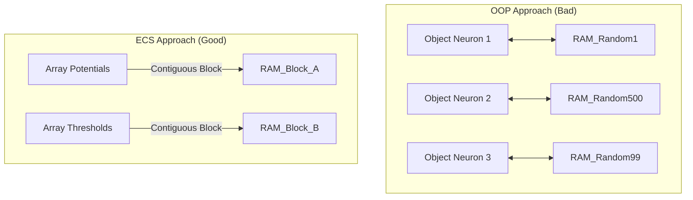

# Chương 03: Phương pháp & Kiến trúc (Methodology & Approach) - Expanded

---

## 3.1 Triết lý Theus POP (Process-Oriented Programming)

Hệ thống được xây dựng trên nền tảng **Theus Framework**, tuân thủ nghiêm ngặt 3 nguyên lý vàng của kiến trúc Hướng Quy trình:

1.  **Dữ liệu "Câm" (Passive Data):** Các `Neuron`, `Synapse` hoàn toàn không có phương thức (method). Không có `neuron.fire()`. Dữ liệu chỉ là các Structs/Records nằm im trong Context.
2.  **Quy trình Thuần túy (Pure Processes):** Mọi logic (tích phân, bắn xung, học) nằm trong hàm.
    *   `process_integrate(neurons, signals) -> new_neurons`
    *   Hàm này nhận data, trả về data mới, không có side-effect ẩn (như in ra màn hình hay gửi mạng).
3.  **Điều phối bằng Cấu hình (Config-Driven):** Thứ tự chạy các Process (`integrate` -> `fire` -> `learn`) được định nghĩa trong file YAML, cho phép ta đổi thứ tự (ví dụ: học trước hay học sau) mà không sửa code Python.

## 3.2 Ảo hóa Neuron: Tại sao ECS thắng OOP?

Để vận hành 1 triệu neuron trên PC, sự khác biệt giữa ECS và OOP là sống còn.

### Mô hình OOP (Cổ điển - Sai lầm)
Mỗi neuron là một Python Object `class Neuron()`.
*   **Bộ nhớ:** Mỗi object tốn ít nhất 48-64 bytes overhead (PyObject header). 1 triệu neuron = ~64MB rác + Dữ liệu thật.
*   **Cache Miss:** Các object nằm rải rác khắp nơi trong RAM (Heap). CPU phải nhảy cóc liên tục để đọc `neuron[1]` rồi `neuron[100]`. Hiệu năng cực thấp.

### Mô hình ECS (Data-Oriented - Chính xác)
Neuron chỉ là một chỉ số (Index) trong các mảng dữ liệu lớn.
*   **Cấu trúc:**
    *   `potentials = [0.1, 0.0, -0.5, ...]` (Array Float32 liên tục)
    *   `thresholds = [1.0, 1.2, 0.9, ...]`
*   **Lợi ích:**
    1.  **Cache Locality:** Khi CPU đọc `potentials[i]`, nó tự động load luôn `potentials[i+1]` vào L1 Cache. Tốc độ xử lý mảng tăng gấp 10-50 lần so với List Object.
    2.  **SIMD:** Các phép toán `potentials += inputs` có thể được vector hóa (tính 8 phép cộng cùng lúc bằng lệnh AVX).

## 3.3 Kiến trúc Lai: SNN như "GPU Cảm xúc"

Chúng ta không bắt SNN làm việc của RL. Hãy hình dung mối quan hệ như CPU và GPU.

*   **Logic (RL Agent - CPU):**
    *   Chạy chậm (theo bước game).
    *   Xử lý logic phức tạp, chiến lược.
    *   *Nhiệm vụ:* Quyết định hành động cuối (Lên/Xuống/Trái/Phải).
*   **Cảm xúc (SNN Engine - GPU):**
    *   Chạy cực nhanh (theo mili-giây, nền tảng sự kiện).
    *   Xử lý song song hàng nghìn tín hiệu giác quan.
    *   *Nhiệm vụ:* Nén dữ liệu thô thành các tín hiệu cảm xúc (`Fear`, `Boredom`) và đẩy sang cho CPU.

**Sơ đồ Luồng Dữ liệu:**

1.  **Input:** Môi trường (Camera/Sensor) -> `Spike Encoder` -> **SNN**.
2.  **Process:** SNN sôi sục, xử lý, lan truyền -> Các neuron Output ("Neuron Sợ", "Neuron Tò mò") bắn xung.
3.  **Distill:** Đếm số xung của Neuron Output trong 100ms -> Biến thành giá trị vô hướng [0..1].
4.  **Output:** Giá trị này được đưa vào hàm Q-Learning:
    *   $Q(s, a) = (1 - \text{Fear}) \cdot \text{Reward} + \text{Curiosity} \cdot \text{Exploration}$

## 3.4 Động cơ Hướng Sự kiện (Event-Driven Engine)

Để tiết kiệm năng lượng, chúng ta áp dụng nguyên tắc "Lazy Evaluation".

*   **Trạng thái Nghỉ:** Nếu môi trường không thay đổi, KHÔNG CÓ neuron nào được tính toán. CPU usage = 0%.
*   **Kích hoạt:** Chỉ dây thần kinh nào nhận được kích thích mới "thức dậy" để cập nhật điện thế.
*   **Kỹ thuật Lazy Leak:**
    *   Thay vì cập nhật `V = V * decay` cho 1 triệu neuron mỗi ms.
    *   Ta lưu `last_update_time` cho từng neuron.
    *   Khi neuron nhận xung mới tại $t_{now}$, ta tính bù rò rỉ một lần:
    *   $V_{now} = V_{old} \cdot \text{decay}^{(t_{now} - t_{last})} + \text{Input}$
