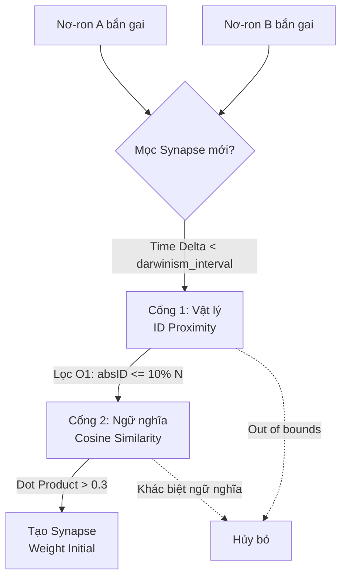

# Chương 05: Cơ chế Nâng cao & Thông minh Tập thể (Advanced Mechanics & Collective Intelligence) - Consolidated

Chương này tổng hợp các cơ chế giúp SNN vượt qua giới hạn của mạng nơ-ron tĩnh, tích hợp cả cơ chế cá thể, tập thể và khả năng tưởng tượng.

---

## 5.1 Độ trễ Thời gian & Bộ nhớ (Temporal Delays)
*   **Nguyên lý:** "Delay là Bộ nhớ". Mạng lưu trữ thông tin về trình tự thời gian thông qua độ dài dây thần kinh.
*   **Cài đặt:** Sử dụng **Circular Time Buckets** ($O(1)$) thay vì Priority Queue để quản lý hàng triệu sự kiện trễ.

## 5.2 Ức chế Bên & Làm nét (Lateral Inhibition & WTA)
*   **Nguyên lý:** Các neuron cạnh tranh nhau để tạo ra tín hiệu sắc nét.
*   **Cài đặt:** Mỗi neuron có **Vùng ức chế cục bộ** (Local Inhibition Zone). Khi một neuron bắn, nó gửi tín hiệu ức chế (-V) tới hàng xóm.
*   **Tối ưu:** Sử dụng **Spatial Hashing** để tìm hàng xóm trong $O(1)$.

## 5.3 Monotonic Additive Plasticity (Tiến hóa Thần kinh Đơn điệu)

Thay vì cắt tỉa bạo lực (Destructive Pruning) gây ra hiện tượng mất trí nhớ thảm khốc (Memory Drift) cho lớp Actor, hệ thống ứng dụng nguyên lý **Sinh tủy Nhưng Không Tiết rụng** (Monotonic Growth) để duy trì cấu trúc không gian ổn định tuyệt đối (Stationarity) cho quá trình học RL.

### 5.3.1 Silent Garbage Collection (Đào thải Tĩnh lặng)
*   **Vấn đề cũ:** Xóa Synapse khi `weight` đang cao tạo ra thay đổi đột ngột lên Vector đặc trưng (Concept Drift), khiến mạng MLP đứng sau bị nổ Gradient (Gradient Explosion).
*   **Giải pháp mới:** Vòng đời bộ nhớ của SNN được bảo tồn. Synapse **bị bào mòn tự nhiên** bằng quy luật STDP. Chỉ khi `weight <= 0.001` (khả năng đóng góp tín hiệu bằng 0), hệ thống mới thu hồi Object vật lý một cách tĩnh lặng. Quá trình này **không tạo ra một gợn sóng hay cú sốc nào** cho mạng MLP.

### 5.3.2 Targeted Synaptogenesis (Mọc rễ Cục bộ với Cổng Kép)
Để chống lại việc bùng nổ liên kết vô nghĩa (Feature Soup), hệ thống liên tục tìm các cặp Nơ-ron cùng bắn gai (Hebbian correlation) và yêu cầu chúng phải thỏa mãn đồng thời **Dual-Gate Eligibility (Cổng Kép)** thì mới được phép tạo liên kết (Synapse) mới:

*   **Cổng 1 (ID Proximity):** Lọc $O(1)$ để tiết kiệm CPU. Cho phép Nơ-ron tạo liên kết cục bộ trong khoảng bán kính nhất định (Ví dụ: `10%` não bộ). Giúp định hình các "Cụm tổ chức" (Topology) thay vì mạng dệt Fully-Connected ngẫu nhiên.
*   **Cổng 2 (Cosine Similarity):** Xác thực ngữ nghĩa. Chỉ những nơ-ron có `Prototype Vector` mang ý nghĩa tương đồng (Ví dụ: Cosine > 0.3) mới được nối với nhau, hạn chế nhiễu logic.

### 5.3.3 Dynamic Skull Limit (Giới hạn Sọ não Động)
Hệ thống học liên tục (Continual Learning) được bảo vệ bằng một định mức dung lượng để chống Memory Leak:
*   Mật độ kết nối hình sao trần (Ceiling Limit): `MAX_SYNAPSES = N * (N - 1) * 0.3` (30% dung lượng kết nối).
*   Tuyệt đối ngừng mọc mới sinh học khi chạm ngưỡng trần này. Nhờ cơ chế Silent GC tự nhiên dọn dẹp các gốc rễ vô dụng, không gian sọ não sẽ được tái tuần hoàn vô hạn cho quá trình học kiến thức mới.

---

## 5.4 Học Tập Xã hội & Thông minh Tập thể (Collective Intelligence)

### 5.4.1 Viral Learning (Học lây nhiễm)
*   Thay vì cộng trung bình trọng số, Agent trao đổi **"Gói Gen Synapse"** (các kết nối hiệu quả nhất).
*   Tri thức lan truyền như virus, nhưng Agent giữ hệ miễn dịch riêng.

### 5.4.2 Mỏ neo Văn hóa (Cultural Anchor)
*   **Ancestor Agent:** Một tác tử ảo học cực chậm, lưu giữ tri thức cốt lõi của quần thể.
*   Giúp các Agent trẻ "Reset" khi bị lạc lối (Catastrophic Forgeting).

### 5.4.3 Cộng hưởng Cảm xúc (Neural Resonance)
*   Tín hiệu cảm xúc của đám đông (Panic, Joy) tác động trực tiếp lên ngưỡng kích hoạt ($V_{th}$) của cá nhân.

---

## 5.5 Giải quyết Xung đột Kiến trúc (Conflict Resolutions)

### 5.5.1 Sandbox Ký sinh (The Parasitic Sandbox)
*   *Vấn đề:* Xung đột giữa Tri thức rắn (Internal Commitment) và Tri thức xã hội (External Viral).
*   *Giải pháp:* Gen ngoại lai chạy trong môi trường **Sandbox** với tư cách là **Shadow Synapse** (Bóng ma).
    *   Nó đưa ra dự đoán song song nhưng không điều khiển hành động.
    *   Chỉ khi Shadow Synapse chứng minh độ chính xác vượt trội liên tục, nó mới được phép "Đảo chính" (Revoke tri thức cũ).

### 5.5.2 Tách biệt Không - Thời gian (Spatiotemporal Decoupling)
*   *Vấn đề:* Kết hợp Vector Spike (Không gian) và STDP (Thời gian).
*   *Giải pháp:* Tách quá trình học làm 2 luồng:
    1.  **Spatial Learning (Unsupervised Clustering):** Xoay `Prototype Vector` để khớp với mẫu hình học của Input.
    2.  **Temporal Learning (Hebbian STDP):** Tăng giảm trọng số vô hướng $w$ dựa trên quan hệ nhân quả thời gian.

---

## 5.6 Vòng lặp Tưởng tượng (The Imagination Loop)

Cơ chế kỹ thuật để SNN tự mô phỏng và rút ra bài học chiến lược.

### 5.6.1 Quy trình Mô phỏng (Simulation Process)
1.  **Detach:** Ngắt kết nối Sensor Input.
2.  **Seed:** Kích hoạt một mẫu neuron ngẫu nhiên (hoặc dựa trên ký ức gần nhất) tại lớp Input.
3.  **Propagate:** Để mạng tự do lan truyền tín hiệu (theo các đường mòn synapse đã học).
4.  **Observe:** Quan sát kết quả tại lớp Cảm xúc (Emotion Layer).

### 5.6.2 Rút trích & Áp dụng Chiến thuật (Extraction & Modulation)
*   **Trường hợp 1: Nightmare (Tưởng tượng ra Cảnh Sợ hãi)**
    *   Kết quả: Neuron `FEAR` bắn mạnh.
    *   **Hành động:** Truy vết ngược (Backtrace) xem neuron nào đã kích hoạt FEAR? Gọi là `Neo_Pre_Fear`.
    *   **Chiến thuật:** Tạo một liên kết ức chế mạnh (Strong Inhibition) từ `Neo_Pre_Fear` tới `Action_Go`.
    *   *Hiệu quả:* Lần sau khi thức, nếu `Neo_Pre_Fear` kích hoạt (dấu hiệu báo trước), nó sẽ tự động khóa hành động nguy hiểm lại.

*   **Trường hợp 2: Fantasy (Tưởng tượng ra Phần thưởng)**
    *   Kết quả: Neuron `JOY` bắn mạnh.
    *   **Hành động:** Xác định `Neo_Pre_Joy`.
    *   **Chiến thuật:** Tăng độ nhạy (Boost Base Threshold) cho `Neo_Pre_Joy`.
    *   *Hiệu quả:* Agent trở nên nhạy bén hơn trong việc săn tìm cơ hội này.

Đây chính là cơ chế **"Học trong Mơ" (Dream Learning)**, giúp Agent thông minh hơn sau mỗi giấc ngủ.
