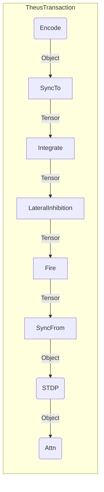

# Chapter 8: Performance Architecture (Theus Optimization)

**Scope**: Technical implementation of the High-Performance SNN runtime.

## 8.1 The "Compute-Sync" Philosophy
The SNN is designed to run in a hybrid mode to balance **Performance** (for training) and **Auditability** (for Theus compliance).

### The Dual State Problem
*   **Object State (Theus)**: `NeuronState`, `SynapseState` objects. Great for transparency, easy to inspect, strict auditing. **Slow** for calculation ($O(N)$ Python overhead).
*   **Tensor State (NumPy)**: `potentials`, `weights`, `thresholds` matrices. Great for calculation (BLAS/LAPACK optimized). **Opaque** to Theus Auditors.

### The Solution
We implement a **Compute-Sync Cycle**:
1.  **SYNC-TO**: At step start, relevant Object data is copied to Tensors (Only if needed, mostly clean).
2.  **COMPUTE**: All heavy math (Integration, Firing, Inhibition) runs purely on Tensors ($O(1)$ Python calls calling C backend).
3.  **SYNC-FROM**: At step end, the modified Tensor state is written back to Objects.

This ensures that **every step is auditable**, but the **step itself runs at C-speed**.

## 8.2 Vectorized SNN Core (`src/core/snn_core_theus.py`)

### A. Matrix Integration
Instead of iterating synapses, we compute potential updates as a single Matrix Multiplication.

$$ \Delta V = (W_{eff} \odot S) \times P_{fired} $$

*   $W_{eff}$: Effective Weight Matrix (Connectivity * Cosine Similarity).
*   $P_{fired}$: Vector of firing neurons.

### B. Masked Firing
Firing is a boolean mask operation:
```python
can_fire_mask = (potentials >= thresholds) & (time - last_fire >= refractory)
fired_indices = np.where(can_fire_mask)[0]
```

## 8.3 Theus Loop Optimization (Composite Process)

### The Bottleneck
Running `Integrate -> Fire -> Learn` as separate Theus Processes introduced 3x Transaction Overhead per 1ms step. For 5 agents, this meant 15 Transactions/ms = 15,000 Transactions/sec. The overhead paralyzed the system.

### The Solution: Composite Process (`process_snn_cycle`)
We bundle the entire SNN micro-cycle into a single `@process`:



*   **Benefit**: Reduces 15 Transactions -> 1 Transaction per cycle.
*   **Result**: Speedup from <1 SPS to >6 SPS (Verbose Logging) or >40 SPS (Silent).

## 8.4 Cross-Attention Performance
The Neo-Cortex (Chapter 4) uses `MultiHeadAttention`.
*   **Batching**: Inputs are batched where possible.
*   **Gradient Clipping**: Gradients are clipped to 1.0 to prevent explosion during the hybrid SNN-RL backprop.
