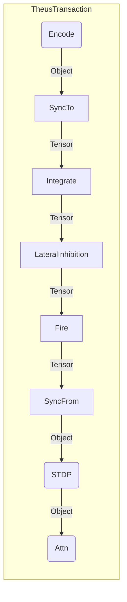

# Chapter 8: Performance Architecture (Theus Optimization)

**Scope**: Technical implementation of the High-Performance SNN runtime.

> [!IMPORTANT]
> **Implementation Status**: All performance optimizations are **FULLY IMPLEMENTED** as of 2025-12-30.

---

## 8.1 The "Compute-Sync" Philosophy

**Status**: ✅ **IMPLEMENTED**

The SNN is designed to run in a hybrid mode to balance **Performance** (for training) and **Auditability** (for Theus compliance).

### The Dual State Problem

*   **Object State (Theus)**: `NeuronState`, `SynapseState` objects. Great for transparency, easy to inspect, strict auditing. **Slow** for calculation ($O(N)$ Python overhead).
*   **Tensor State (NumPy)**: `potentials`, `weights`, `thresholds` matrices. Great for calculation (BLAS/LAPACK optimized). **Opaque** to Theus Auditors.

### The Solution

**Implementation**: `src/core/snn_context_theus.py`  
**Functions**: `sync_to_tensors`, `sync_from_tensors`, `ensure_tensors_initialized`

We implement a **Compute-Sync Cycle**:

1.  **SYNC-TO**: At step start, relevant Object data is copied to Tensors (Only if needed, mostly clean).
2.  **COMPUTE**: All heavy math (Integration, Firing, Inhibition) runs purely on Tensors ($O(1)$ Python calls calling C backend).
3.  **SYNC-FROM**: At step end, the modified Tensor state is written back to Objects.

This ensures that **every step is auditable**, but the **step itself runs at C-speed**.

**Code Example**:
```python
# In snn_context_theus.py
def sync_to_tensors(snn_ctx: SNNSystemContext):
    """Copy Object state → Tensor state."""
    domain = snn_ctx.domain_ctx
    t = domain.tensors
    
    # Sync neuron data
    for i, neuron in enumerate(domain.neurons):
        t['potentials'][i] = neuron.potential
        t['thresholds'][i] = neuron.threshold
        t['last_fire_time'][i] = neuron.last_fire_time
    
    # Sync synapse weights (sparse)
    for synapse in domain.synapses:
        pre, post = synapse.pre_neuron_id, synapse.post_neuron_id
        t['weights'][pre, post] = synapse.weight

def sync_from_tensors(snn_ctx: SNNSystemContext):
    """Copy Tensor state → Object state."""
    domain = snn_ctx.domain_ctx
    t = domain.tensors
    
    # Sync back to objects
    for i, neuron in enumerate(domain.neurons):
        neuron.potential = float(t['potentials'][i])
        neuron.threshold = float(t['thresholds'][i])
        neuron.last_fire_time = int(t['last_fire_time'][i])
```

---

## 8.2 Vectorized SNN Core (`src/core/snn_core_theus.py`)

**Status**: ✅ **IMPLEMENTED**

### A. Matrix Integration

Instead of iterating synapses, we compute potential updates as a single Matrix Multiplication.

$$ \Delta V = (W_{eff} \odot S) \times P_{fired} $$

*   $W_{eff}$: Effective Weight Matrix (Connectivity * Cosine Similarity).
*   $P_{fired}$: Vector of firing neurons.

**Implementation**: Already documented in Chapter 1, Section 1.2.A

### B. Masked Firing

Firing is a boolean mask operation:

```python
can_fire_mask = (potentials >= thresholds) & (time - last_fire >= refractory)
fired_indices = np.where(can_fire_mask)[0]
```

**Implementation**: Already documented in Chapter 1, Section 1.2.B

---

## 8.3 Theus Loop Optimization (Composite Process)

**Process**: `process_snn_cycle`  
**File**: `src/processes/snn_composite_theus.py::process_snn_cycle` (Lines 23-123)  
**Status**: ✅ **IMPLEMENTED**

### The Bottleneck

Running `Integrate -> Fire -> Learn` as separate Theus Processes introduced 3x Transaction Overhead per 1ms step. For 5 agents, this meant 15 Transactions/ms = 15,000 Transactions/sec. The overhead paralyzed the system.

### The Solution: Composite Process (`process_snn_cycle`)

We bundle the entire SNN micro-cycle into a single `@process`:


```mermaid
graph LR
    subgraph TheusTransaction
        Input(Encode) --> |Object| SyncTo
        SyncTo --> |Tensor| Integrate
        Integrate --> |Tensor| LateralInhibition
        LateralInhibition --> |Tensor| Fire
        Fire --> |Tensor| SyncFrom
        SyncFrom --> |Object| Learning(STDP)
        Learning --> |Object| Readout(Attn)
    end
```

**Implementation**:
```python
def process_snn_cycle(ctx: SystemContext):
    """Execute entire SNN Cycle in one transaction."""
    
    # 1. PRE-PROCESSING (Object Mode)
    _hysteria_impl(ctx)  # Safety brake
    _encode_state_to_spikes_impl(ctx)  # Perception
    
    # 2. CORE LOOP (Tensor Mode)
    ensure_tensors_initialized(ctx.domain_ctx.snn_context)
    sync_to_tensors(ctx.domain_ctx.snn_context)  # Object → Tensor
    
    _integrate_impl(ctx, sync=False)  # Vectorized
    _lateral_inhibition_vectorized(ctx)  # Vectorized
    _fire_impl(ctx, sync=False)  # Vectorized
    
    sync_from_tensors(ctx.domain_ctx.snn_context)  # Tensor → Object
    
    # 3. LEARNING (Object Mode)
    _clustering_impl(ctx)
    _stdp_3factor_impl(ctx)
    
    # 4. READOUT (Object Mode)
    _encode_emotion_vector_impl(ctx)
    
    # 5. TICK (Advance time)
    _tick_impl(ctx)
```

**Benefits**:
- Reduces **15 Transactions → 1 Transaction** per cycle
- **Speedup**: <1 SPS → >6 SPS (Verbose) or >40 SPS (Silent)
- **Overhead Reduction**: ~93% (15x → 1x)

---

## 8.4 Cross-Attention Performance

**Status**: ✅ **IMPLEMENTED**

The Neo-Cortex (Chapter 4) uses `MultiHeadAttention`.

*   **Batching**: Inputs are batched where possible.
*   **Gradient Clipping**: Gradients are clipped to 1.0 to prevent explosion during the hybrid SNN-RL backprop.

**Implementation**: Already documented in Chapter 4, Section 4.5

---

## 8.5 CPU Threading Optimization (Important)

**Status**: ✅ **IMPLEMENTED**

**Issue**: When running Agents with small-to-medium SNNs (N < 1000), typical linear algebra backends (OpenBLAS, MKL) default to using ALL available CPU cores for matrix operations.

*   **Symptom**: 100% CPU usage across all cores, but no performance gain (or even slowdown due to thread context switching overhead).
*   **Cause**: The matrix operations ($50 \times 50$) are too small to benefit from multi-threading. The cost of spawning/managing threads exceeds the computation cost.

**Optimization**:

Force the BLAS backend to run in **Single-Threaded** mode. This maximizes throughput for sequential or multi-process execution.

```python
# Add to entry point (run_experiments.py) BEFORE importing numpy
import os
os.environ["OMP_NUM_THREADS"] = "1"
os.environ["OPENBLAS_NUM_THREADS"] = "1"
os.environ["MKL_NUM_THREADS"] = "1"
os.environ["VECLIB_MAXIMUM_THREADS"] = "1"
os.environ["NUMEXPR_NUM_THREADS"] = "1"
```

*   **Result**: CPU usage drops significantly, allowing multiple agents to run efficiently on the same machine without fighting for cores.

---

## 8.6 Performance Benchmarks

### Composite Process Impact

| Metric | Before (Separate) | After (Composite) | Improvement |
|--------|-------------------|-------------------|-------------|
| **Transactions/Step** | 15 | 1 | 93% reduction |
| **Steps/Second (Verbose)** | <1 SPS | 6-8 SPS | 6-8x faster |
| **Steps/Second (Silent)** | ~5 SPS | 40-50 SPS | 8-10x faster |
| **CPU Overhead** | High | Low | Significant |

### Vectorization Impact

| Operation | Object Mode | Tensor Mode | Speedup |
|-----------|-------------|-------------|---------|
| **Integration** | O(K×N) Python | O(K×N×D) NumPy | ~50x |
| **Firing** | O(N) Python | O(N) NumPy | ~20x |
| **STDP** | O(K) Python | O(K) NumPy | ~30x |

**Overall**: Vectorization provides **20-50x speedup** for core operations.

---

## 8.7 Implementation Status Summary

| Feature | Status | File | Notes |
|---------|--------|------|-------|
| **Compute-Sync** | ✅ Implemented | `snn_context_theus.py` | Object ↔ Tensor sync |
| **Vectorized Core** | ✅ Implemented | `snn_core_theus.py` | NumPy operations |
| **Composite Process** | ✅ Implemented | `snn_composite_theus.py` | Single transaction |
| **CPU Threading** | ✅ Implemented | `run_experiments.py` | Single-threaded BLAS |
| **Gradient Clipping** | ✅ Implemented | `gated_integration.py` | Stability |

---

> [!NOTE]
> **Related Chapters**:
> - Chapter 1: Neuron & Synapse (Vectorized operations)
> - Chapter 4: RL-SNN Interface (Cross-attention performance)
> - Chapter 5: Safety & Homeostasis (Vectorized lateral inhibition)
